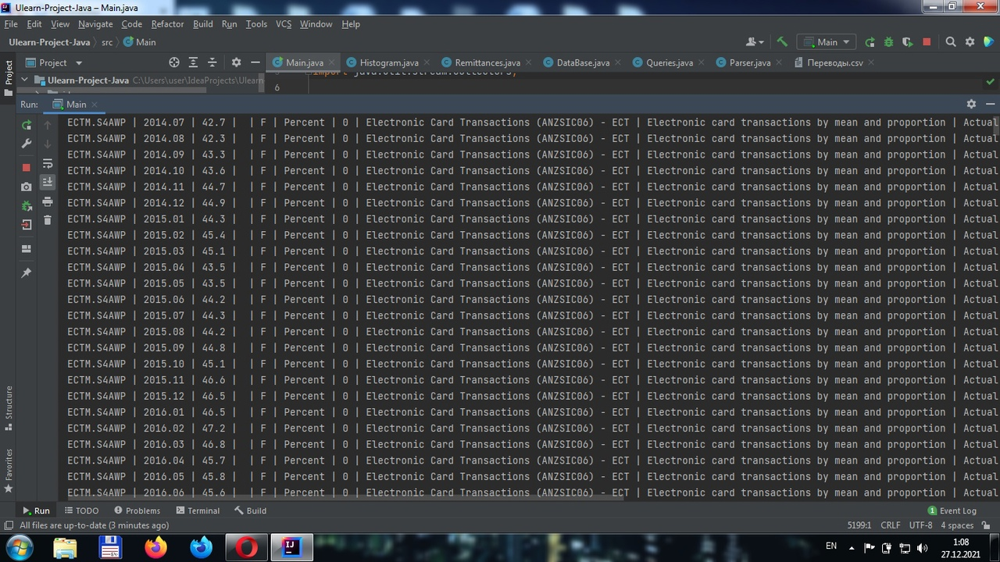
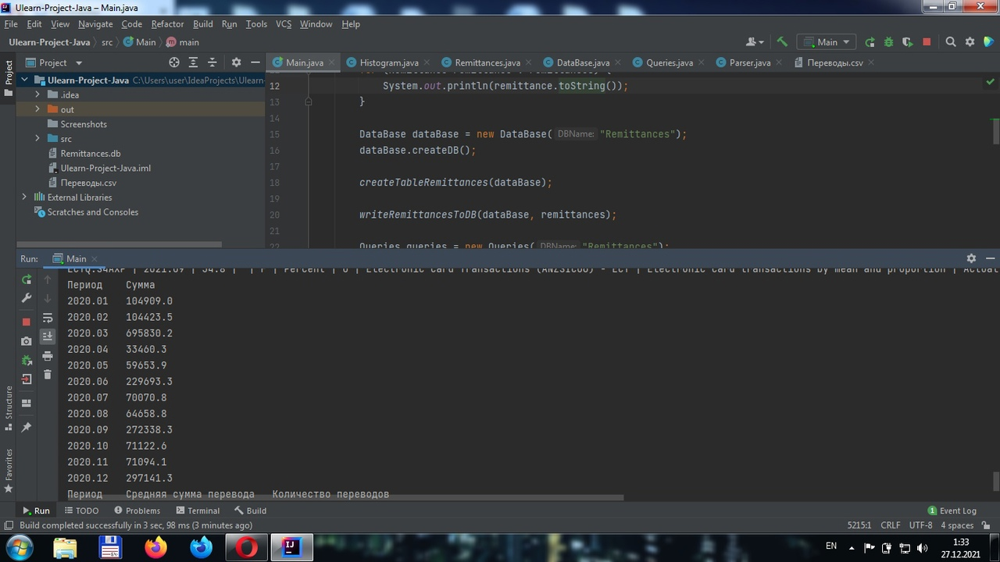
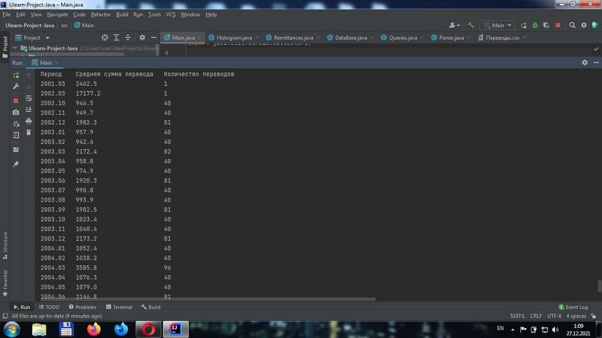
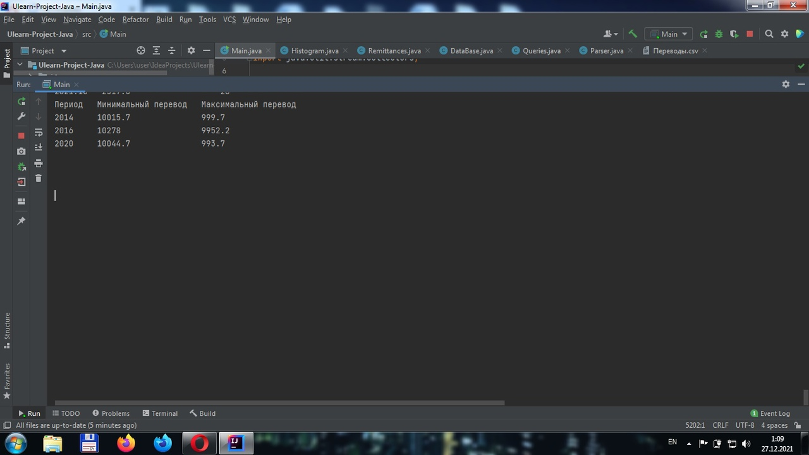
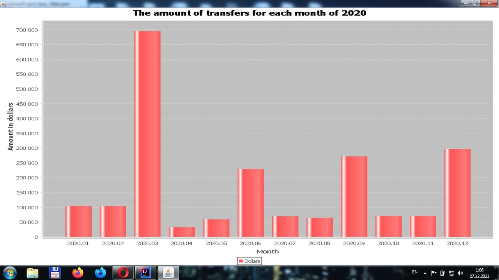

Вариант 4 (Переводы)

Последовательность работы по проекту: 
1. Создан класс Remittance (Перевод) для хранения информации об одном переводе со всеми полями исходного файла CSV, а также с методами получения информации в различных формах.
2. Создан класс Remittances, хранящий все переводы Remittance с базовыми методами (добавление / получение).
3. Создан класс Parser для парсинга исходного CSV файла на экземпляры Remittance.
4. Файл CSV распарсен, все экземпляры Remittance сохранены в классе Remittances, а также выведены в консоль в отформатированном виде.
5. Создан класс DataBase для создания базы данных SQLite, создания таблицы и добавления в таблицу новых записей (используется JDBC).
6. Все экземпляры Remittance сохранены в созданной базе данных.
7. Создан класс Histogram для создания столбчатой диаграммы, используя библиотеку JFreeChart.
8. Создан класс Queries с методами для создания SQL-запросов согласно варианту задания.
9. Все SQL-запросы выполнены, результат их выполнения выведен в консоль в отформатированной виде. Результат выполнения 1-ого запроса дополнительно представлен в виде столбчатой диаграммы при помощи класса Histogram. 
 
 
 
Результат работы проекта: 
1) Экземпляры Remittance в отформатированном виде (всего 18183 экземпляра): 

2) Результат 1-ого запроса на вывод суммы всех переводов (где это возможно) в долларах за 2020 год, сгруппированных по месяцам: 

3) Результат 2-ого запроса на вывод среднего размера перевода в долларах, а также их количество, за каждый уникальный период (230 строк): 

4) Результат 3-его запроса на вывод максимальных и минимальных переводов в 2014, 2016 и 2020 годах: 

5) Результат создания столбчатой диаграммы на основе полученных данных в 1-ом запросе: 
